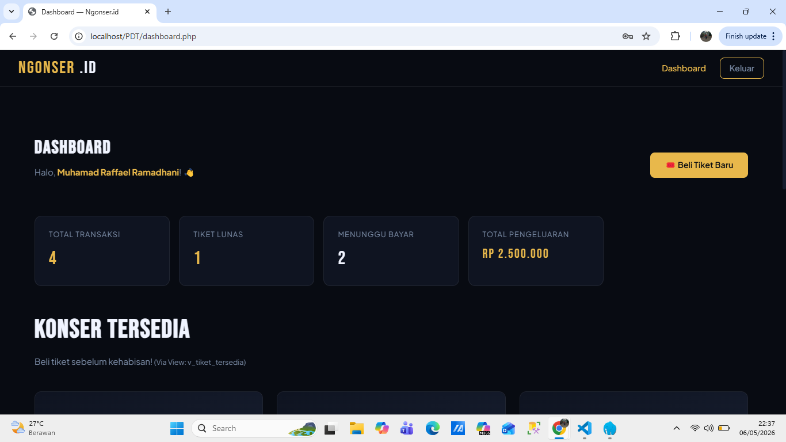
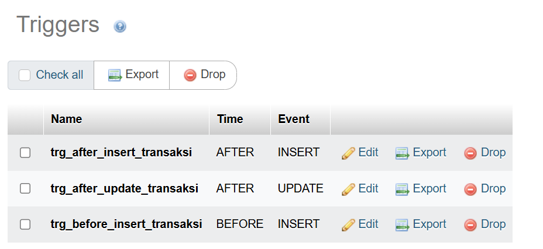
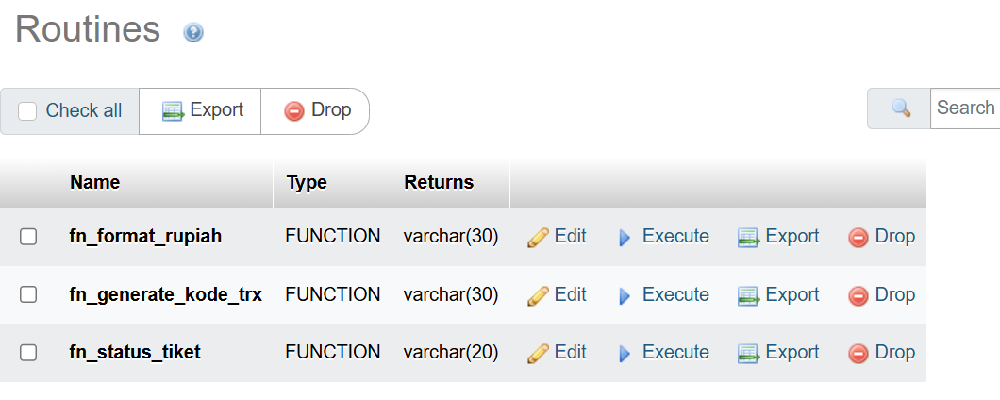

# 🎤🎟️ Ngonser.id (Proyek UAP)

Proyek ini merupakan sistem pemesanan tiket konser berbasis web yang dibangun menggunakan PHP dan MySQL. Tujuannya sebagai platform untuk membantu pengguna melihat daftar konser, memilih kategori tiket, melakukan booking tiket, serta mengelola transaksi secara lebih mudah dan terstruktur.
Sistem ini dilengkapi dengan fitur login pengguna, dashboard user, pemesanan tiket, konfirmasi pembayaran, serta panel admin untuk mengelola konser, tiket, pengguna, dan transaksi. Selain itu, proyek ini juga menerapkan konsep basis data lanjutan seperti stored procedure, function, trigger, view, transaction, backup database, dan simulasi deadlock untuk mendukung keamanan serta konsistensi data.

## 🖼️ Tampilan Website

Berikut adalah tampilan halaman utama dari sistem **NGONSER.ID**:




## 📌 Detail Konsep

🗂️ **Stored Procedure** bertindak seperti SOP internal yang menetapkan alur eksekusi berbagai operasi penting di sistem. Procedure ini disimpan langsung di lapisan database, sehingga dapat membantu menjaga konsistensi, efisiensi, dan keamanan eksekusi, terutama pada sistem yang digunakan oleh banyak user secara bersamaan.

Dalam project **Ngonser.id**, stored procedure digunakan untuk menangani proses penting seperti penambahan tiket, penghapusan tiket, checkout pemesanan tiket, dan konfirmasi pembayaran. Dengan adanya stored procedure, proses yang berhubungan langsung dengan data transaksi tidak hanya dijalankan dari sisi PHP, tetapi juga dikontrol langsung oleh database agar lebih aman dan terstruktur.

Selain itu, sistem ini juga menerapkan beberapa konsep database lanjutan lainnya, seperti **function**, **trigger**, **view**, **transaction**, **backup database**, dan **simulasi deadlock**. Konsep-konsep ini digunakan untuk mendukung pengelolaan data konser, tiket, transaksi, dan pengguna agar sistem dapat berjalan lebih stabil.


- **Function** digunakan untuk membantu menghasilkan nilai tertentu, seperti status ketersediaan tiket berdasarkan jumlah kuota dan tiket yang sudah terjual.
- **Trigger** digunakan untuk menjalankan proses otomatis ketika terjadi perubahan data, misalnya saat transaksi pembayaran dikonfirmasi dan stok tiket perlu diperbarui.
- **View** digunakan untuk menampilkan data gabungan dari beberapa tabel agar laporan dan riwayat transaksi lebih mudah dibaca.
- **Transaction** digunakan untuk memastikan proses pemesanan tiket berjalan secara konsisten, sehingga data transaksi dan tiket tidak berubah sebagian saja.
- **Backup Database** digunakan untuk menjaga keamanan data agar dapat dipulihkan kembali jika terjadi kesalahan atau kehilangan data.
- **Deadlock Simulation** digunakan untuk menggambarkan kondisi ketika dua transaksi saling menunggu resource, serta bagaimana sistem database menangani kondisi tersebut.

Dengan penerapan konsep tersebut, Ngonser.id tidak hanya berfungsi sebagai aplikasi pemesanan tiket konser, tetapi juga menjadi implementasi nyata dari pengelolaan database yang lebih aman, terstruktur, dan konsisten.



## 💾 Backup Otomatis

Untuk menjaga ketersediaan dan keamanan data, sistem ini dilengkapi fitur backup otomatis menggunakan `mysqldump` dan `task scheduler`. Backup dilakukan oleh admin dan hasilnya disimpan dengan nama file yang mencakup `timestamp`, sehingga mudah ditelusuri. Semua file backup disimpan di direktori `storage/backups`.

Backup dilakukan melalui file `backup.php` dan hanya dapat diakses oleh pengguna dengan role **admin**.

---

### 📄 backup.php

```php
<?php
require_once __DIR__ . '/config/database.php';

if (session_status() === PHP_SESSION_NONE) session_start();

requireAdmin();

$db = getDB();
$backupDir = __DIR__ . '/storage/backups';

if (!is_dir($backupDir)) {
    mkdir($backupDir, 0755, true);
}

$response = ['status' => 'error', 'message' => ''];

if ($_SERVER['REQUEST_METHOD'] === 'POST' && ($_POST['action'] ?? '') === 'create_backup') {
    try {
        $timestamp = date('Y-m-d_H-i-s');
        $backupFile = $backupDir . '/backup_' . DB_NAME . '_' . $timestamp . '.sql';

        $mysqlDir = 'C:\laragon\bin\mysql\mysql-8.0.30-winx64\bin\mysqldump.exe';

        $command = sprintf(
            '"%s" --host=%s --user=%s %s --single-transaction --quick --lock-tables=false > %s',
            $mysqlDir,
            escapeshellarg(DB_HOST),
            escapeshellarg(DB_USER),
            escapeshellarg(DB_NAME),
            escapeshellarg($backupFile)
        );

        if (defined('DB_PASS') && DB_PASS !== '') {
            $command = sprintf(
                '"%s" --host=%s --user=%s --password=%s %s --single-transaction --quick --lock-tables=false > %s',
                $mysqlDir,
                escapeshellarg(DB_HOST),
                escapeshellarg(DB_USER),
                escapeshellarg(DB_PASS),
                escapeshellarg(DB_NAME),
                escapeshellarg($backupFile)
            );
        }

        $output = null;
        $returnVar = null;
        exec($command, $output, $returnVar);

        if ($returnVar === 0 && file_exists($backupFile)) {
            $fileSize = filesize($backupFile);
            $response = [
                'status' => 'success',
                'message' => "✅ Backup berhasil dibuat! ({$timestamp})<br>Ukuran: " . number_format($fileSize / 1024, 2) . ' KB'
            ];
            flashMessage('success', $response['message']);
        } else {
            $response = ['status' => 'error', 'message' => '❌ Gagal membuat backup. Pastikan mysqldump terinstall.'];
            flashMessage('error', $response['message']);
        }
    } catch (Exception $e) {
        $response = ['status' => 'error', 'message' => '❌ Error: ' . $e->getMessage()];
        flashMessage('error', $response['message']);
    }

    redirect(APP_URL . '/backup_list.php');
}

$flash = getFlash();
?>

<!DOCTYPE html>
<html lang="id">
<head>
  <meta charset="UTF-8">
  <meta name="viewport" content="width=device-width, initial-scale=1.0">
  <title>Backup Database — Admin · <?= APP_NAME ?></title>
  <link rel="stylesheet" href="<?= APP_URL ?>/assets/css/style.css">
</head>
<body>
<nav class="navbar">
  <a class="navbar-brand" href="<?= APP_URL ?>/index.php">NGONSER<span>.ID</span></a>
  <div class="nav-links">
    <a href="<?= APP_URL ?>/admin.php">Admin Panel</a>
    <a href="<?= APP_URL ?>/logout.php" class="btn btn-outline btn-sm">Keluar</a>
  </div>
</nav>

<?php if ($flash): ?>
<div class="container" style="padding-top:1rem;">
  <div class="flash flash-<?= e($flash['type']) ?>"><?= $flash['msg'] ?></div>
</div>
<?php endif; ?>

<div class="container section">
  <div style="max-width:600px;margin:0 auto;">
    <h1 class="page-title">BACKUP DATABASE</h1>
    <p class="page-subtitle">Buat backup database <?= e(DB_NAME) ?> sekarang</p>

    <div class="card">
      <div class="card-body">
        <form method="POST">
          <input type="hidden" name="action" value="create_backup">
          <button type="submit" class="btn btn-primary" style="width:100%;padding:12px;">
            🔄 Buat Backup Sekarang
          </button>
        </form>

        <hr style="margin:20px 0;border:none;border-top:1px solid var(--border);">

        <p style="font-size:.9rem;color:var(--text-muted);margin:0;">
          <strong>Info:</strong> Backup akan disimpan di folder <code>storage/backups/</code> dengan format SQL.<br>
          Backup otomatis mencakup semua tabel dan data dengan timestamp.
        </p>
      </div>
    </div>

    <div style="margin-top:20px;">
      <a href="<?= APP_URL ?>/backup_list.php" class="btn btn-outline" style="width:100%;text-align:center;padding:10px;">
        📋 Lihat Daftar Backup
      </a>
    </div>
  </div>
</div>

</body>
</html>
```
